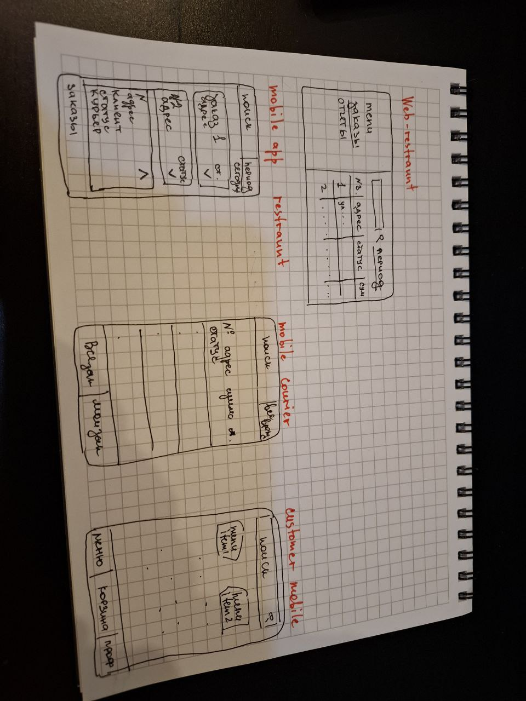

# Учебный проект Food Delivery

## Описание

Food Delivery - сервис доставки еды из ресторана. 
Цель проекта - изучение принципов Kotlin Backend разработки, инструментов для работы. 

## Документация

1. Маркетинг и аналитика
    1. [Целевая аудитория](./docs/01-users/01-target-audience.md)
    2. [Заинтересованные лица](./docs/01-users/02-stakeholders.md)
2. Аналитика:
   1. [Функциональные требования](./docs/02-analytics/01-functional-requiremens.md)
   2. [Нефункциональные требования](./docs/02-analytics/02-nonfunctional-requirements.md)
   3. [Жизненный цикл заказа](docs/02-analytics/03-order-lifecycle.svg)
   4. [Статусы заказа](./docs/02-analytics/04-order-statuses.svg) 
3. DevOps
   1. [Файлы сборки](docker-compose.yml)
4. Архитектура
   1. [Архитектура](./docs/03-architecture/01-architecture.svg) 
   2. [Architecture decision records](./docs/03-architecture/02-adrs.md)
   3. [Описание API](./docs/03-architecture/03-api.md)
   4. [Диаграмма сущностей](./docs/03-architecture/03-er-diagramm.svg)
5. Тесты
6. MVP
   1. [Sprint #1](docs/06-mvp/01-sprint.md)

## Визуальная схема фронтенда
